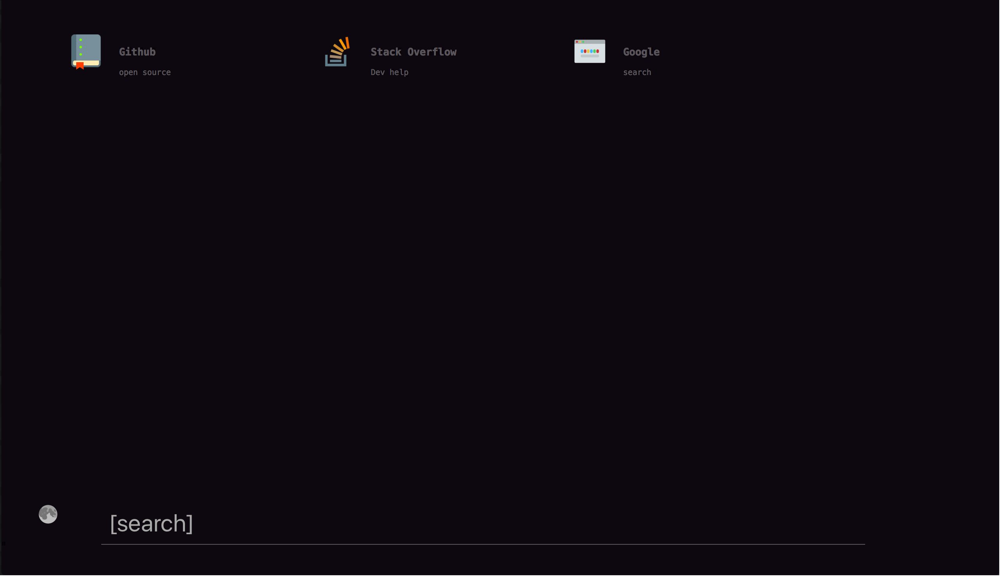
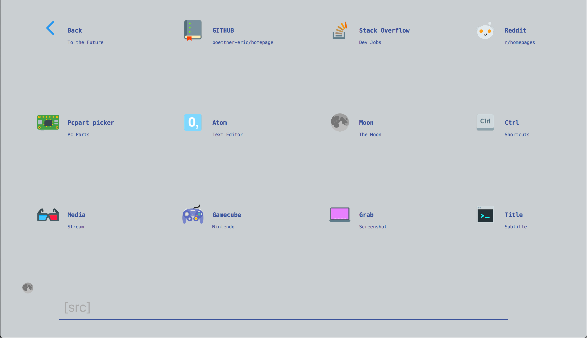

# Homepage

## [Hosted on Gitub.io](https://boettner-eric.github.io/Homepage/)


This project is an attempt at a better desktop and mobile launch page.  It has keyboard shortcuts, nested folders, cool design and is super easy to edit

# Features:
* ### Scripted page creation
 The script.py file generates html files with minimal user input
```
    git $ python3 script.py
    mode : s g (single/generate) -  g
    enter filename : sample
    ---------------------
    tile : 1
    link : https://Github.com
    name : Github
    subtittle : open source
    src : gh
    ---------------------
    tile : 2
    link : https://stackoverflow.com
    name : Stack Overflow
    subtittle : Dev help
    src : st
    ---------------------
    tile : 3
    link : https://Google
    name : Google
    subtittle : search
    src : go
    ---------------------
    File Created
```
 

* ### Nightmode
(small moon icon in bottom left)
  to edit nightmode/base colors open keys.js and edit lines 27-29
  ```javascript
  document.documentElement.style.setProperty('--background', '#CACFD2');
  document.documentElement.style.setProperty('--background-alt', '#CACFD2');
  document.documentElement.style.setProperty('--base-txt', '#3A529B');
```

* ### Fully customizable tiles and nested folders
   To edit a tile open template.html.  The main block of code should look like this:
```html
<a href="insert link" id="1" class="lBox">
	<div class="button">
	    
	</div>
	<h3>Back</h3>
    <p>To the Future</p>
</a>
```

  - h3 contains the website tittle,
  - p contains a  subtittle
  - "button" contains the image
  -

  To add a folder just copy the template.html file and rename it.  In the original add a tile for your folder and in the new html file just change the url of back to "template.html" or the url of the source page.  

* ### Responsive design


* ### An example subfolder


* This is a fork of - https://github.com/Capuno/Decaux - My version is very different but started from this code base

* All icons are from the - https://icons8.com color theme
