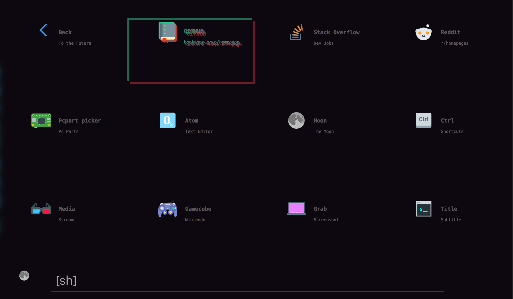
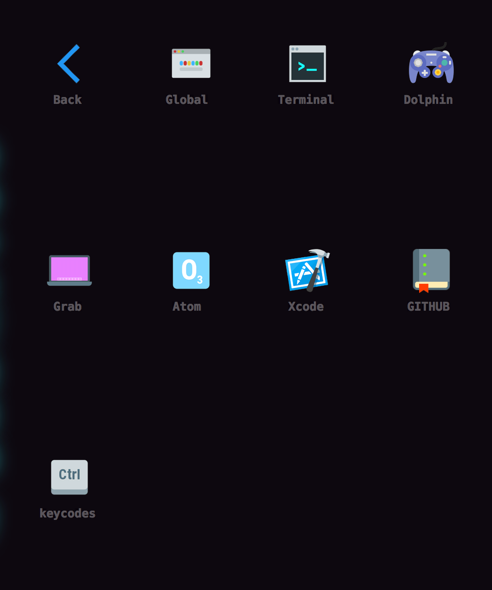
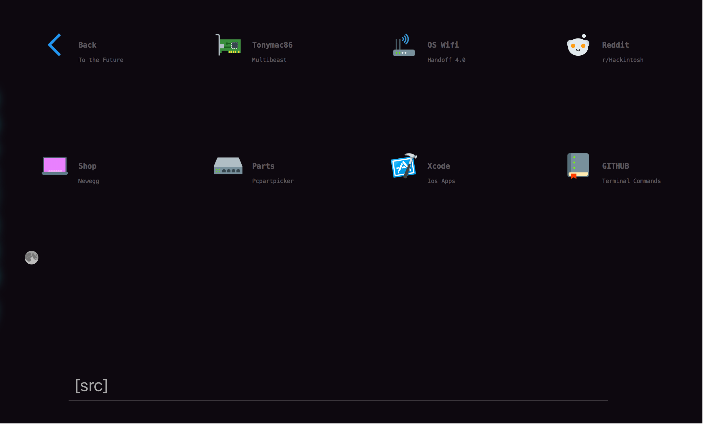

Homepage

This project is an attempt at a better desktop and mobile launch page.  It has keyboard shortcuts, nested folders, cool design and is easy to edit.

Features:
- Nightmode (small moon in bottom left)
  to edit nightmode/base colors open keys.js and edit line 27/29
  <
  27 document.documentElement.style.setProperty('--background', '#CACFD2');
  28 document.documentElement.style.setProperty('--background-alt', '#CACFD2');
  29 document.documentElement.style.setProperty('--base-txt', '#3A529B');
  >
- Fully customizable tiles and nested folders
   To edit a tile open template.html.  The main block of code should look like this:

          <a href="insert link" id="1" class="lBox">
		

	       	    
		

		<h3>Back</h3>
                
To the Future

            </a>
            
  h3 displays the website tittle, p the subtittle and "button" contains the image, just edit these and you have a new tile

  To add a folder just copy the template.html file and rename it.  In the original add a tile for your folder and in the new html file just change the url of back to "template.html" or the url of the source page.  

- Responsive design

- An example subfolder 

* This is a fork of - https://github.com/Capuno/Decaux - My version is very different but started from this open source project

- All icons are from https://icons8.com [color theme]
