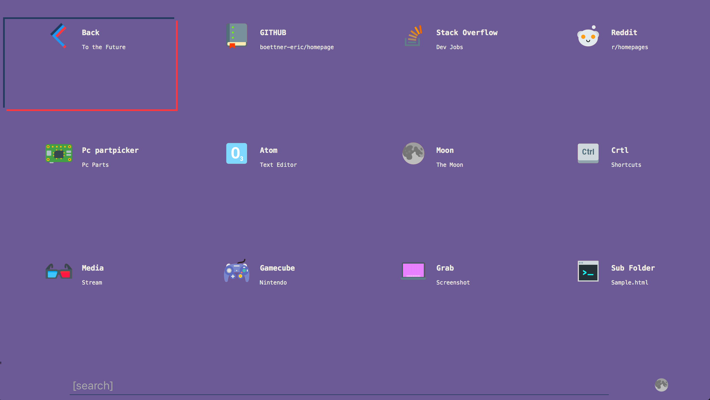
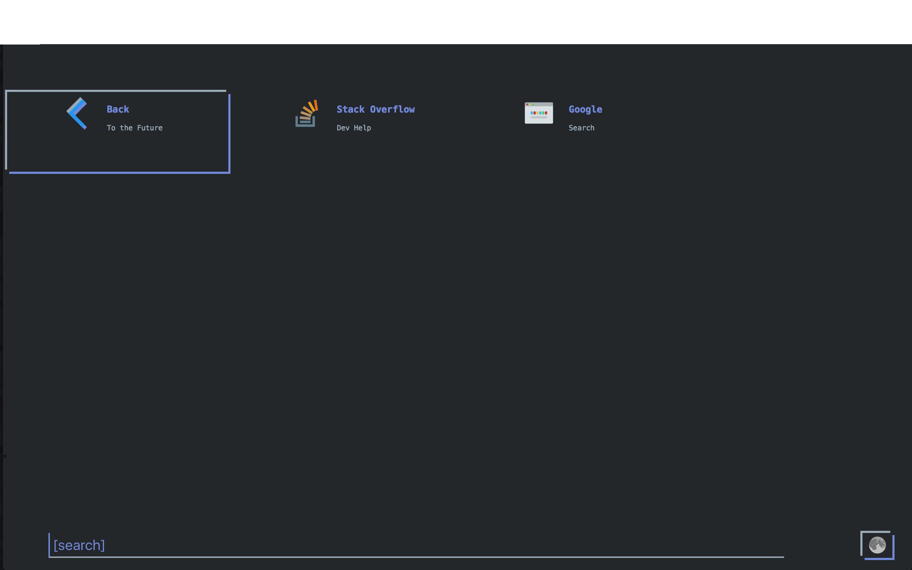
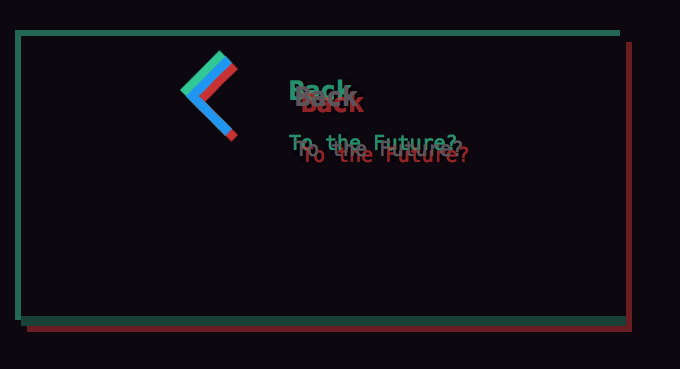
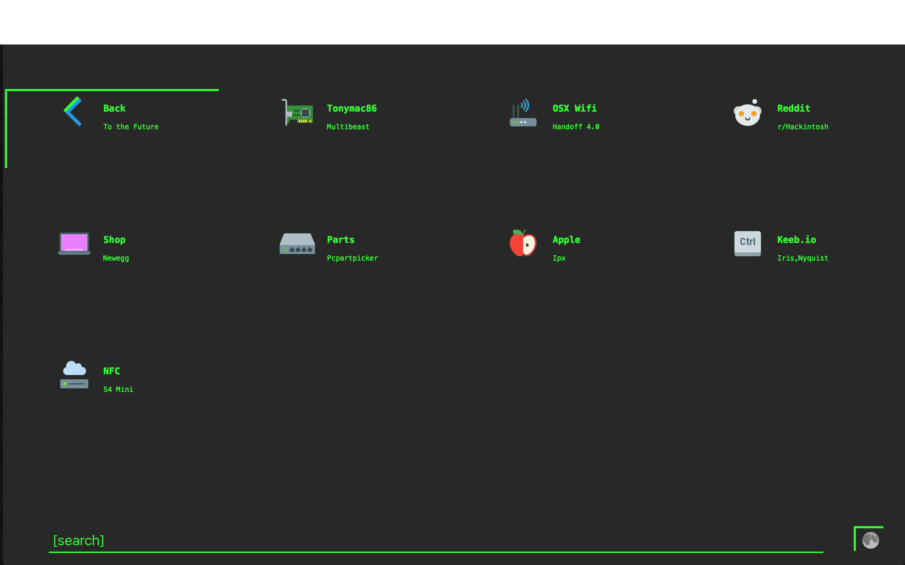
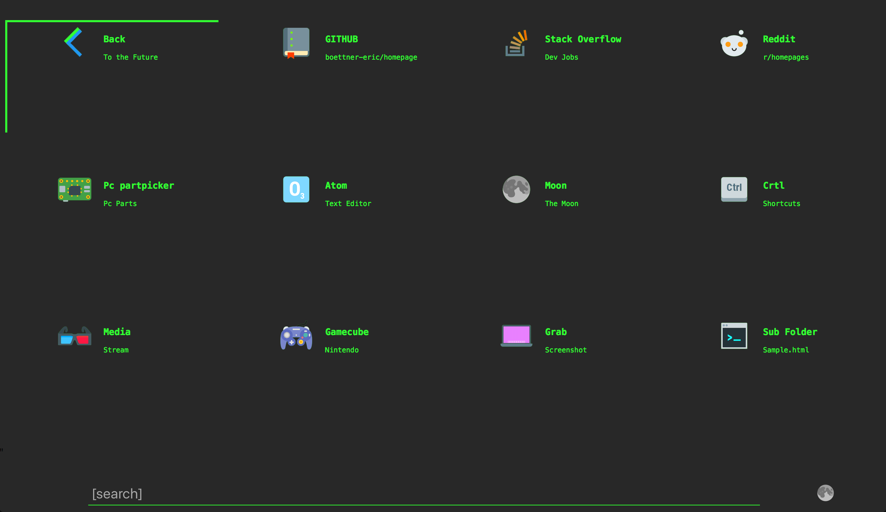
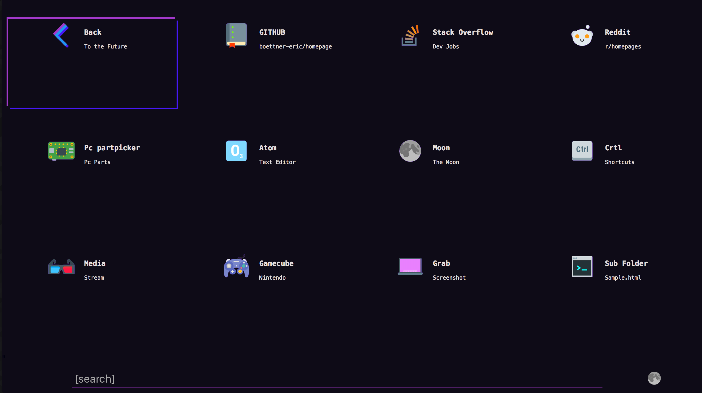
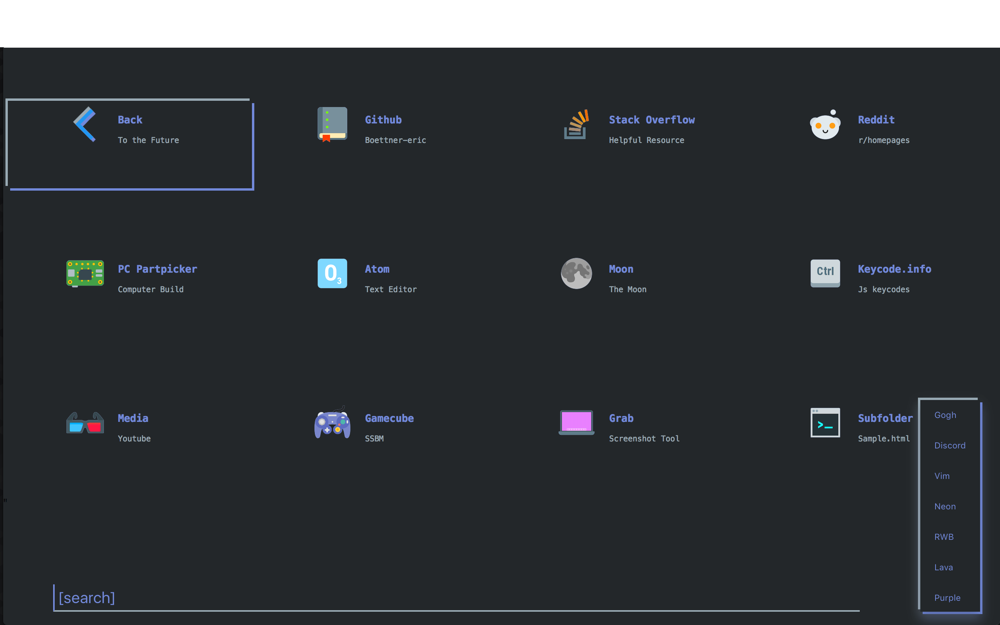
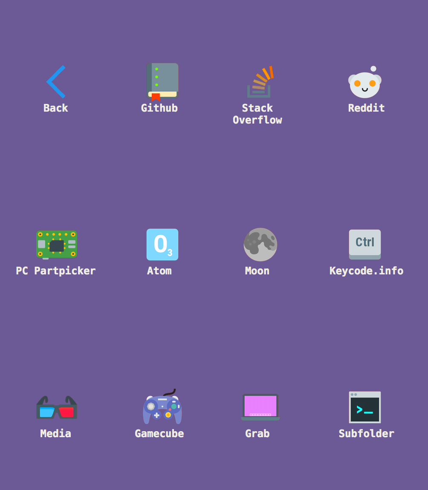

# Homepage

## [Hosted on Gitub.io](https://boettner-eric.github.io/Homepage/)


This project is an attempt at a better desktop and mobile launch page.  It has keyboard shortcuts, nested folders, cool design and is super easy to edit.


# Features:
* ### Scripted page creation
 The script.py file generates html files with minimal user input
```
    git $ python3 script.py
    type : t p (theme/webpage) - p
    mode : s g (single/generate) -  g
    enter filename : sample
    number of tiles (max 12) : 3
    ---------------------
    tile : 1
    url : https://Github.com
    title : Github
    subtitle : open source
    icon : gh
    ---------------------
    tile : 2
    url : https://stackoverflow.com
    title : Stack Overflow
    subtitle : Dev help
    icon : st
    ---------------------
    tile : 3
    url : https://Google
    title : Google
    subtitle : search
    icon : go
    ---------------------
    File Created
```
 
 * Script.py also supports formatting new themes. Simply type the hex values for each color and it'll write the javascript for you

```
  git $ python3 script.py
  type : t p (theme/webpage) - t
  Theme Name               - example
  Background Color (hex)   - #FFFFFF
  Alt Background Color     - #FFFFFF
  Accent Color             - #000000
  Compliment Color         - #000000
  Main Text Color          - #000000
  Subtext Color            - #000000
  ---------------------------------------------------------------------------
  function example() {
    document.documentElement.style.setProperty('--background', '#FFFFFF');
    document.documentElement.style.setProperty('--background-alt', '#FFFFFF');
    document.documentElement.style.setProperty('--base-txt', '#000000');
    document.documentElement.style.setProperty('--main-cl', '#000000');
    document.documentElement.style.setProperty('--comp-cl', '#000000');
    document.documentElement.style.setProperty('--sub-txt', '#000000');)
    setCookie("example")
  }
  ----------------------------------------------------------------------------
  copy and paste into the keys.js file in the section for
  themes then add a keyboard shortcut/case for the new theme
```
* ### Fully customizable tiles and nested folders
   To edit a tile open template.html.  The main block of code should look like this:
   
```html
<a href="index.html" id="1" class="lBox">
	<div class="button">
	    
	</div>
	<h3>Back</h3>
    <p>To the Future</p>
</a>
```
  - a contains the url
  - h3 contains the website title,
  ```Html
  <h3>Title</h3>
  ```
  - p contains a  subtitle
  ```Html
  <p>Subtitle</p>
  ```
  - "button" contains the image
  ```html
  <div class="button">
      
  </div>
  ```
  - To add a folder just add a tile for the new folder and use script.py to generate a new file. Put the previous folder's filename in the url of the back button and you should have a functioning folder. An example folder :


* ### Custom Icons
 - Icons are stored in the SRC folder and you can add your own icon to any tile.
 ```html
 <div class="button">
    
 </div>
 ```
 here **ba.png** is the name of the icon and it is located in the **src** folder hence **src/ba.png**.  When using script.py just add the name of your icon file without the file type (i.e. .png) and it'll handle the rest.

* ### Themes
    Homepage has a theme  button for shifting between different text and background colors. To switch colors just click the moon icon in the bottom right (**mn.png** in src) Theme colors are stored in keys.js lines 27-66.  For example here is the Vim theme
    ```javascript
    document.documentElement.style.setProperty('--background', '#282828');
    document.documentElement.style.setProperty('--background-alt', '#282828');
    document.documentElement.style.setProperty('--base-txt', '#33FF33');
    document.documentElement.style.setProperty('--main-cl', '#282828');
    document.documentElement.style.setProperty('--comp-cl', '#33FF33');
    document.documentElement.style.setProperty('--sub-txt', '#33FF33');
    ```
  Here is index.html in Vim theme
  
  Or here is index.html in Neon Theme
  
  Or finally Discord theme
  
  * Themes are saved as cookies and read on every reload allowing the theme to persist through folders and new instances
  * To create a theme follow the template or use script.py
  * Cookies might not work on hosted version but do work well locally

* ### Keyboard Shortcuts
 - Homepage supports custom keyboard shortcuts for websites.  Currently index.html only contains one shortcut (b -> back to github) but keys.js contains instructions and structure for adding custom shortcuts and filters based on folder (for any new pages created in the template b -> back to index.html). See lines 115-124 to add custom shortcuts.
 - Themes are currently mapped to 1-7 for quick switches between themes
 ```javascript
 var fileName = location.href.split("/").slice(-1) // current url
 if (fileName == "index.html"){ // separate shortcut for each folder
         if (key == 66) { // b shortcut - back
             window.location.replace("https://github.com/Boettner-eric/Homepage"); // add to this if statement for shortcuts on index.html
         }
     } else {
             if (key == 66) {  // b shortcut - back
                window.location.replace("index.html");
            } // add to this if statement for shortcuts on new folder pages
        }
 ```
 *Javascript codes for each key can be found on [this](keycode.info) awesome site
 *Key shortcuts don't work on the github hosted site unless javascript is enabled in browser

* ### Responsive design
 Homepage was created with mobile support first and is fully responsive.  It features one breakpoint at 650 pixels for the smallest displays but resizes well at any resolution<sup>1</sup>

<sup>1</sup> Feel free to submit an issue for any weird looking or broken resolutions, Currently images are slightly off center for mobile resolutions and vertical spacing isn't optimized for ipx


* This is a fork of - https://github.com/Capuno/Decaux - My version is very different but started from this code base

* All icons are from the - https://icons8.com color theme

* I hope you enjoy using this homepage ! If you have any questions you can submit an issue through github
